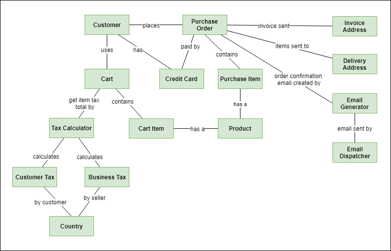
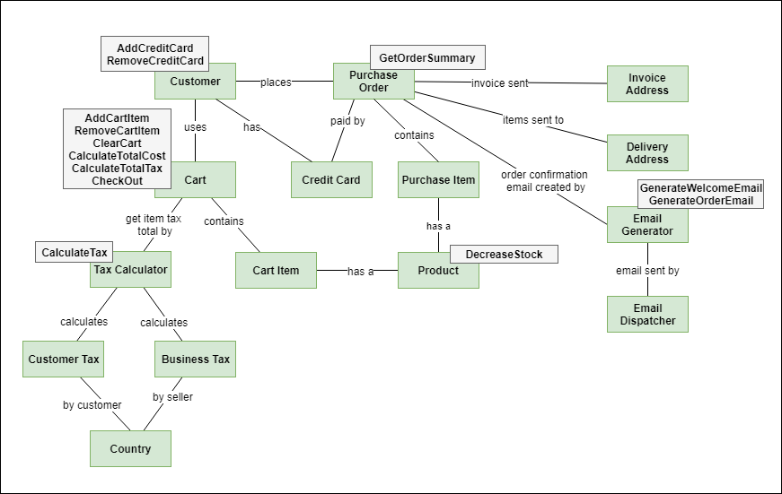
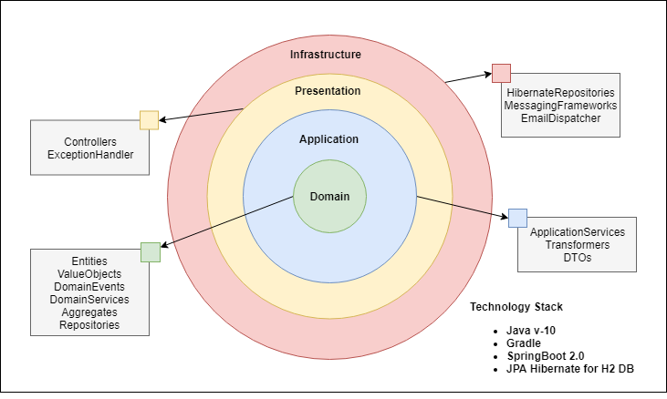
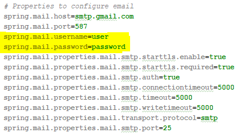

# Overview

Here you will find the code example for the Domain Driven Design course in Acamica.

The code is trying to apply all the patterns introduced in the course using Spring Boot 2.0 framework.

The domain you are going to find is a simple e-commerce application. The classic e-commerce application with Products, Shopping Cart and Purchase Orders.

The domain example is taken from ZAN KAVTASKIN’s series of blogs. In these blogs Zan uses this domain to explain ddd. There you can check the entire list of requirements and a detailed explanation of a solution written in C#. Here is the **[link](http://www.zankavtaskin.com/2014/12/applied-domain-driven-design-ddd-part-0.html)**:

# Initial Requirements

Here is the list of requirements we are going to use as base:
* Ability to put products to purchase into the shopping cart 
* Ability to see the total cost for all of the items in the cart 
* Ability to see the total cost of each item in the cart
* Ability to see the total cost for all of the items in the cart with total tax 
* Ability to specify the address of where all of the products are going to be sent to
* Ability to add a note to the delivery address with special instructions
* Ability to associate and remove credit cards to customer
* Ability to select customer credit card during checkout
* Ability to check that the items in cart are still available 
* Ability to receive order confirmation email with order number
* Ability to receive welcome email for new customers
* Ability to specify invoice address
* Ability to configure customer taxes by country
* Ability to configure business taxes by country
* Ability to receive a welcome email when customer is created

# Initial Domain Model

This is the domain model draft where you can see the main concepts and their relationship



# Some Behaviors

Here you can see some of the behaviors or actions we can get from the requirements



# Basic Architecture

And finally here you can see a basic architecture of the application and the technology stack used



# How to run the application
Before you run the application ensure change the email configuration in application.properties

For gmail smtp configuration, you only need to update user and password with your personal email information



And after that you need to enable the access to low secure applications in your personal account. Use this **[link](https://myaccount.google.com/lesssecureapps )** to do it.

To execute the unit tests just run the next command:
```
./gradlew test
```

To run the application just clone the code and in the root folder execute the next command:
```
./gradlew bootRun
```
Once the task finish the application is going to be available at http://localhost:8080. Here you have a **[postman collection](https://github.corp.globant.com/hector-hurtado/acamica-ddd-course/tree/master/postman)** to use the application


